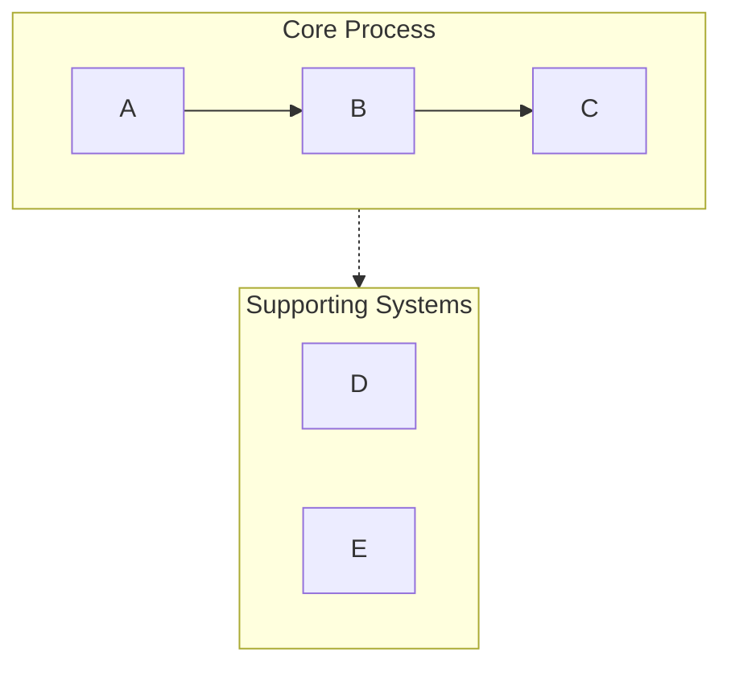
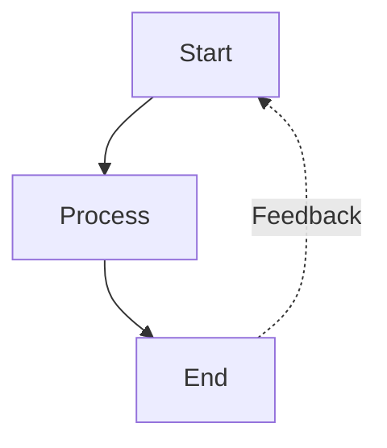
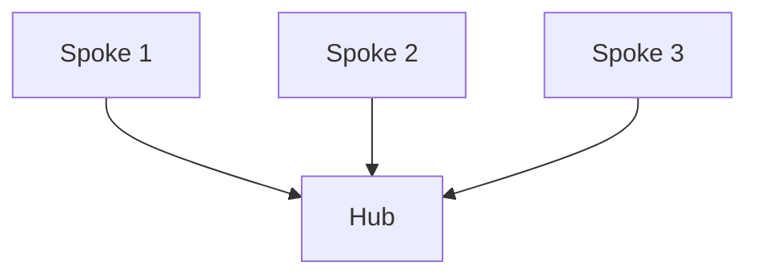

# Examples

Read when selecting a layout or constructing a similar diagram.

## Example Usage Patterns

**Pattern 1: Basic request**
```
User: "Visualize the software development lifecycle"
Response: [Analyze → Choose graph TB → Generate with standard detail]
```

**Pattern 2: With configuration**
```
User: "Create a horizontal flowchart of our sales process with lots of detail"
Response: [Analyze → Choose graph LR → Generate with detailed level]
```

**Pattern 3: Comparison**
```
User: "Compare traditional AI vs AI agents"
Response: [Analyze → Choose comparison layout → Generate with contrasting styles]
```

## Common Patterns

### Swimlane Pattern (Grouping)


### Feedback Loop Pattern


### Hub and Spoke Pattern


